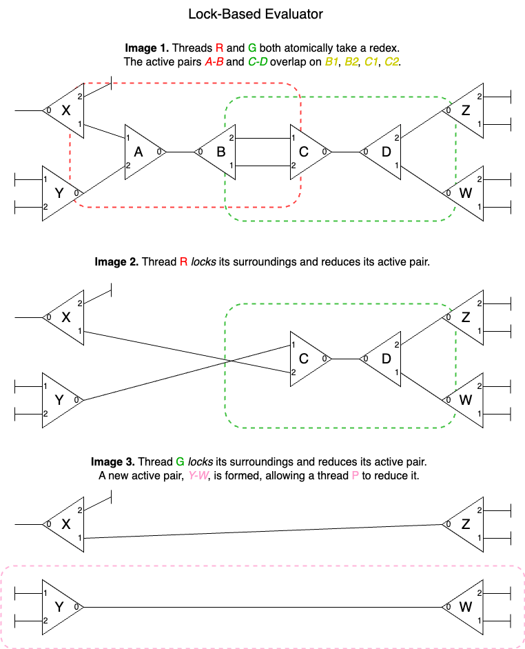

# HVM-Core: a parallel Interaction Combinator evaluator

HVM-Core is a parallel evaluator for extended [Symmetric Interaction Combinators](https://www-lipn.univ-paris13.fr/~mazza/papers/CombSem-MSCS.pdf).

We provide a raw syntax for specifying nets and a Rust implementation that
achieves up to **10 billion rewrites per second** on Apple M3 Max CPU. HVM's
optimal evaluation semantics and concurrent model of computation make it a great
compile target for high-level languages seeking massive parallelism.

HVM-Core will be used as the compile target for
[HVM](https://github.com/higherorderco/hvm) on its upcoming update.

## Usage

Install HVM-Core as:

```
cargo install hvm-core
```

Then, run the interpeter as:

```
hvmc run file.hvmc -s
```

Or compile it to a faster executable:

```
hvmc compile file.hvmc
./file
```

Both versions will compute the program's normal form using all available cores.

## Example

HVMC is a low-level compile target for high-level languages. It provides a raw
syntax for wiring interaction nets. For example:

```javascript
@add = (<+ a b> (a b))

@sum = (?<(#1 @sumS) a> a)

@sumS = ({2 a b} c)
  & @add ~ (e (d c))
  & @sum ~ (a d)
  & @sum ~ (b e)

@main = a
  & @sum ~ (#24 a)
```

The file above implements a recursive sum. As you can see, its syntax isn't
meant to be very human readable. Fortunatelly, we have
[HVM-Lang](https://github.com/HigherOrderCO/hvm-lang), a tool that generates
`.hvmc` files from a familiar functional syntax. On HVM-Lang, you can write
instead:

```javascript
add = λa λb (+ a b)

sum = λn match n {
  0   : 1
  1+p : (add (sum p) (sum p))
}

main = (sum 24)
```

Which compiles to the first program via `hvml compile main.hvm`. For more
examples, see the [`/examples`](/examples) directory. If you do want to
understand the hardcore syntax, keep reading. 

## Language

HVM-Core's textual syntax represents interaction combinators via an AST:

```
<TERM> ::=
  <ERA> ::= "*"
  <CON> ::= "(" <TERM> " " <TERM> ")"
  <TUP> ::= "[" <TERM> " " <TERM> "]"
  <DUP> ::= "{" <label> " " <TERM> " " <TERM> "}"
  <REF> ::= "@" <name>
  <U60> ::= "#" <value>
  <OP2> ::= "<" <op> " " <TERM> " " <TERM> ">"
  <MAT> ::= "?" "<" <TERM> " " <TERM> ">"
  <VAR> ::= <name>

<NET> ::=
  <ROOT> ::= <TERM>
  <RDEX> ::= "&" <TERM> "~" <TERM> <NET>

<BOOK> ::= 
  <DEF> ::= "@" <name> "=" <NET> <BOOK>
  <END> ::= <EOF> 
```

As you can see, HVMC extends the original system with some performance-relevant
features, including top-level definitions (closed nets), unboxed 60-bit machine
integers, numeric operations and numeric pattern-matching.

- `ERA`: an eraser node, as defined on the original paper.

- `CON`: a constructor node, as defined on the original paper.

- `TUP`: a tuple node. Has the same behavior of `CON`.

- `DUP`: a duplicator, or fan node, as defined on the original paper.
  Additionally, it can include a label. Dups with different labels will commute.
  This allows for increased expressivity (nested loops).

- `VAR`: a named variable, used to create a wire. Each name must occur twice,
  denoting both endpoints of a wire.

- `REF`: a reference to a top-level definition, which is itself a closed net.
  That reference is unrolled lazily, allowing for recursive functions to be
  implemented without the need for Church numerals and the like.

- `U60`: an unboxed 60-bit unsigned integer.

- `OP2`: a binary operation on u60 operands.

- `MAT`: a pattern-matching operator on u60 values.

Note that terms form a tree-like structure. Yet, interaction combinators are not
trees, but graphs; terms aren't enough to express all possible nets. To fix
that, we provide the `& <TERM> ~ <TERM>` syntax, which connects the top-most
main port of each tree. This allows us to build any closed nets with a single
free wire. For example, to build the closed net:

```
R       .............
:       :           :
:      /_\         /_\
:    ..: :..     ..: :..
:    :     :     :     :
:   /_\   /_\   /_\   /_\
:...: :   : :...: :   :.:
      *   :.......:
```

We could use the following syntax:

```
@main
  = R
  & ((R *) (x y))
  ~ ((y x) (z z))
```

Here, `@main` is the name of the closed net, `R` is used to denote its single
free wire, each CON node is denoted as `(x y)`, and the ERA node is represented
as a `*`. The wires from an aux port to a main port are denoted by the tree
hierarchy, the wires between aux ports are denoted by named variables, and the
single wire between main ports is denoted by the `& A ~ B` syntax. Note this
always represents an active pair (or redex)!

## CPU Evaluator

HVMC's main evaluator is a Rust package that runs on the CPU, although GPU
versions are in development (see below). It is completely eager, which means it
will reduce *every* generated active pair (redex) in an ultra-greedy,
massively-parallel fashion. 

The evaluator works by keeping a vector of current active pairs (redexes) and,
for each redex in parallel, performing local "interaction", or "graph rewrite",
as described below. To distribute work, a simple task stealing queue is used.

Note that, due to HVM's ultra-strict evaluator, languages targeting it should
convert top-level definitions to
[supercombinators](https://en.wikipedia.org/wiki/Supercombinator), which enables
recursive definitions halt. HVM-Lang performs this transformation before
converting to HVM-Core.

## GPU Evaluator

The GPU evaluator is similar to the CPU one, except two main differences: "1/4"
rewrites and a task-sharing grid.  For example, on NVidia's RTX 4090, we keep a
grid of 128x128 redex bags, where each bag contains redexes to be processed by a
"squad", which consists of 4 threads, each one performing "1/4" of the rewrite,
which increases the granularity. This allows us to keep `16,384` active sqxuads,
for a total of `65,536` active threads, which means the maximum degree of
parallelism (65k) is achieved at just 16k redexes. Visually:

```
REDEX ::= (Ptr32, Ptr32)

    A1 --|\        /|-- B2
         | |A0--B0| |
    A2 --|/        \|-- B1

REDEX_BAG ::= Vec<REDEX>

    [(A0,B0), (C0,D0), (E0,F0), ...]

REDEX_GRID ::= Matrix<128, 128 REDEX_BAG>

    [ ] -- [ ] -- [ ] -- [ ] -- [ ] -- [ ] -- [ ] -- [ ] ...
     |      |      |      |      |      |      |      |
    [ ] -- [ ] -- [ ] -- [ ] -- [ ] -- [ ] -- [ ] -- [ ] ...
     |      |      |      |      |      |      |      |
    [ ] -- [ ] -- [ ] -- [ ] -- [ ] -- [ ] -- [ ] -- [ ] ...
     |      |      |      |      |      |      |      |
    [ ] -- [ ] -- [ ] -- [ ] -- [ ] -- [ ] -- [ ] -- [ ] ...
     |      |      |      |      |      |      |      |
    [ ] -- [ ] -- [ ] -- [ ] -- [ ] -- [ ] -- [ ] -- [ ] ...
     |      |      |      |      |      |      |      |
    [ ] -- [ ] -- [ ] -- [ ] -- [ ] -- [ ] -- [ ] -- [ ] ...
     |      |      |      |      |      |      |      |
    [ ] -- [ ] -- [ ] -- [ ] -- [ ] -- [ ] -- [ ] -- [ ] ...
     |      |      |      |      |      |      |      |
    [ ] -- [ ] -- [ ] -- [ ] -- [ ] -- [ ] -- [ ] -- [ ] ...
     |      |      |      |      |      |      |      |
    ...    ...    ...    ...    ...    ...    ...    ... 

SQUAD ::= Vec<4, THREAD>

THREAD ::=

    loop {
      if (A, B) = pop_redex():
        atomic_rewrite(A, B)
      share_redexes()
    }

    atomic_rewrite(A, B):
      ... match redex type ...
      ... perform atomic links ...

    atomic_link(a, b):
      ... see algorith on 'paper/' ...

RESULT:

    - thread 0 links A1 -> B1
    - thread 1 links B1 -> A1
    - thread 2 links A2 -> B2
    - thread 3 links B2 -> A2

OUTPUT:

    A1 <--------------> B1
    A2 <--------------> B2
```


## Interactions

The available interactions are the same described on the reference paper, namely
annihilation and commutation rules, plus a few additional interactions,
including primitive numeric operations, conditionals, and dereference. The core
interactions are:

```
()---()
~~~~~~~ ERA-ERA
nothing
```

```
A1 --|\
     |a|-- ()
A2 --|/
~~~~~~~~~~~~~ CTR-ERA
A1 ------- ()
A2 ------- ()
```

```
A1 --|\     /|-- B2
     |a|---|b|   
A2 --|/     \|-- B1
~~~~~~~~~~~~~~~~~~~ CTR-CTR (if a ~~ b)
A1 -----, ,----- B2
         X
A2 -----' '----- B1
```

```
A1 --|\         /|-- B2
     |a|-------|b|   
A2 --|/         \|-- B1
~~~~~~~~~~~~~~~~~~~~~~~ CTR-CTR (if a !~ b)
      /|-------|\
A1 --|b|       |a|-- B2
      \|--, ,--|/
           X
      /|--' '--|\
A2 --|b|       |a|-- B1
      \|-------|/
```

The dereference interactions happen when a @REF node interacts with another
node. When that node is a constructor, the dereference will be unrolled
efficiently. This makes HVM practical, because, without it, top-level
definitions would need to be implemented with DUP nodes. This would cause
considerable overhead when trying to implement functions, due to DUP nodes
incremental copying nature. When the other node is anything else, that implies
two closed nets got disconnected from the main graph, so both nodes are
collected, allowing recursive functions to halt without infinite expansions.

```
() -- @REF
~~~~~~~~~~ ERA-REF
nothing
```

```
A1 --|\
     | |-- @REF
A2 --|/
~~~~~~~~~~~~~~~~ CTR-REF
A1 --|\
     | |-- {val}
A2 --|/
```

Since Interaction Combinator nodes only have 1 active port, which is a property
that is essential for key computational characteristics such as strong
confluence, we can't have a binary numeric operation node. Instead, we split
numeric operations in two nodes: OP2, which processes the first operand and
returns an OP1 node, which then processes the second operand, performs the
computation, and connects the result to the return wire.

```
A1 --,
     [}-- #X
A2 --' 
~~~~~~~~~~~~~~ OP2-NUM
A2 --[#X}-- A1
```

```
A1 --[#X}-- #Y
~~~~~~~~~~~~~~ OP1-NUM
A1 -- #Z
```

Note that the OP2 operator doesn't store the operation type. Instead, it is
stored on 4 unused bits of the left operand. As such, an additional operation
called "load-op-type" is used to load the next operation on the left operand.
See the `/examples` directory for more info. Below is a table with all available
operations:

sym | name
--- | ---------
`+` | addition
`-` | subtraction
`*` | multiplication
`/` | division
`%` | modulus
`==`| equal-to
`!=`| not-equal-to
`<` | less-than
`>` | greater-than
`<=`| less-than-or-equal
`>=`| greater-than-or-equal
`&` | bitwise-and
`\|`| bitwise-or
`^` | bitwise-xor
`~` | bitwise-not
`<<`| left-shift
`>>`| right-shift

Since HVM already provides plenty of solutions for branching (global references,
lambda encoded booleans and pattern-matching, etc.), the pattern-match operation
is only necessary to read bits from numbers: otherwise, numbers would be "black
boxes" that can't interact with the rest of the program. The way it works is
simple: it receives a number, two branches (case-zero and case-succ, stored in a
CON node) and a return wire. If the number is 0, it erases the case-succ branch
and returns the case-zero branch. Otherwise, it erases the case-zero branch and
returns the case-succ branch applied to the predecessor of the number.

```
A1 --,
     (?)-- #X
A2 --' 
~~~~~~~~~~~~~~~~~~ MAT-NUM (#X > 0)
           /|-- A2
      /|--| |
A1 --| |   \|-- #(X-1)
      \|-- ()
```

```
A1 --,
     (?)-- #X
A2 --' 
~~~~~~~~~~~~~~~~~~ MAT-NUM (#X == 0)
      /|-- ()
A1 --| |   
      \|-- A2
```

Note that some interactions like NUM-ERA are omitted, but should logically
follow from the ones described above.

## Memory Layout

The memory layout is optimized for efficiency. Conceptually, it equals:

```rust
// A pointer is a 64-bit word
type Ptr = u64;

// A node stores its two aux ports
struct Node {
  p1: Ptr, // this node's fst aux port
  p2: Ptr, // this node's snd aux port 
}

// A redex links two main ports
struct Redex {
  a: Ptr, // main port of node A
  b: Ptr, // main port of node B
}

// A closed net
struct Net {
  root: Ptr,       // a free wire
  rdex: Vec<Redex> // a vector of redexes
  heap: Vec<Node>  // a vector of nodes
}
```

As you can see, the memory layout resembles the textual syntax, with nets being
represented as a vector of trees, with the 'redex' buffer storing the tree roots
(as active pairs), and the 'nodes' buffer storing all the nodes. Each node has
two 32-bit pointers and, thus, uses exactly 64 bits. Pointers include a 4-bit
tag, a 28-bit label (used for DUP colors, OP2 operators) and a 32-bit addr,
which allows addressing a 2 GB space per instance. There are 12 pointer types:

```rust
VR1: Tag = 0x0; // Variable to aux port 1
VR2: Tag = 0x1; // Variable to aux port 2
RD1: Tag = 0x2; // Redirect to aux port 1
RD2: Tag = 0x3; // Redirect to aux port 2
REF: Tag = 0x4; // Lazy closed net
ERA: Tag = 0x5; // Unboxed eraser
NUM: Tag = 0x6; // Unboxed number
OP2: Tag = 0x7; // Binary numeric operation
OP1: Tag = 0x8; // Unary numeric operation
MAT: Tag = 0x9; // Numeric pattern-matching
LAM: Tag = 0xA; // Main port of lam node
TUP: Tag = 0xB; // Main port of tup node
DUP: Tag = 0xC; // Main port of dup node
```

This memory-efficient format allows for a fast implementation in many
situations; for example, an interaction combinator annihilation can be performed
with just 2 atomic CAS.

Note that LAM, TUP and DUP nodes are identical: they are interaction combinator
nodes, and they annihilate/commute based on their labels being identical. The
distinction is made for better printing, but isn't used internally.

We also provide unboxed 60-bit unsigned integers, which allows HVMC to store raw
data with minimal loss. For example, to store a raw 3.75 KB buffer, one could
use a perfect binary tree of CON nodes with a depth of 8, as follows:

```javascript
@buff = (((((((((X0 X1) (X2 X3)) ((X4 X5) (X6 X7))) ...)))))))
```

This would use a total of 511 nodes, which takes a space of almost exactly 8 KB
on HVMC. As such, while buffers are not part of the spec, we can store raw data
with a ~46% efficiency using interaction-net-based trees. This structure isn't
as compact as arrays, but it allows us access and transform data in parallel,
which is a great tradeoff in practice.

## Lock-free Algorithm

At the heart of HVM-Core's massively parallel evaluator lies a lock-free
algorithm that allows performing interaction combinator rewrites in a concurrent
environment with minimal contention and completely avoiding locks and backoffs.
To understand the difference, see the images below:

### Before: using locks

In a lock-based interaction net evaluator, threads must lock the entire
surrounding region of an active pair (redex) before reducing it. That is a
source of contention and can results in backoffs, which completely prevents a
thread from making progress, reducing performance.



### After: lock-free

The lock-free approach works by attempting to perform the link with a single
compare-and-swap. When it succeeds, nothing else needs to be done. When it
fails, we place redirection wires that semantically complete the rewrite without
any interaction. Then, when a main port is connected to a redirection wire, it
traverses and consumes the entire path, eaching its target location. If it is an
auxiliary port, we store with a cas, essentially moving a node to another
thread. If it is a main port, we create a new redex, which can then be reduced
in parallel. This essentially results in an "implicit ownership" scheme that
allows threads to collaborate in a surgically precise contention-avoiding dance.


For more information, check the [paper/draft.pdf](paper/draft.pdf).

## Contributing

To verify if there's no performance regression:

```bash
git checkout main
cargo bench -- --save-baseline main # save the unchanged code as "main"
git checkout <your-branch>
cargo bench -- --baseline main      # compare your changes with the "main" branch
```

To verify if there's no correctness regression, run `cargo test`. You can add
`cargo-insta` with `cargo install cargo-insta` and run `cargo insta test` to see
if all test cases pass, if some don't and they need to be changed, you can run
`cargo insta review` to review the snapshots and correct them if necessary.

## Community

HVM-Core is part of [Higher Order Company](https://HigherOrderCO.com/)'s efforts
to harness massively parallelism. Join our [Discord](https://discord.HigherOrderCO.com/)!
